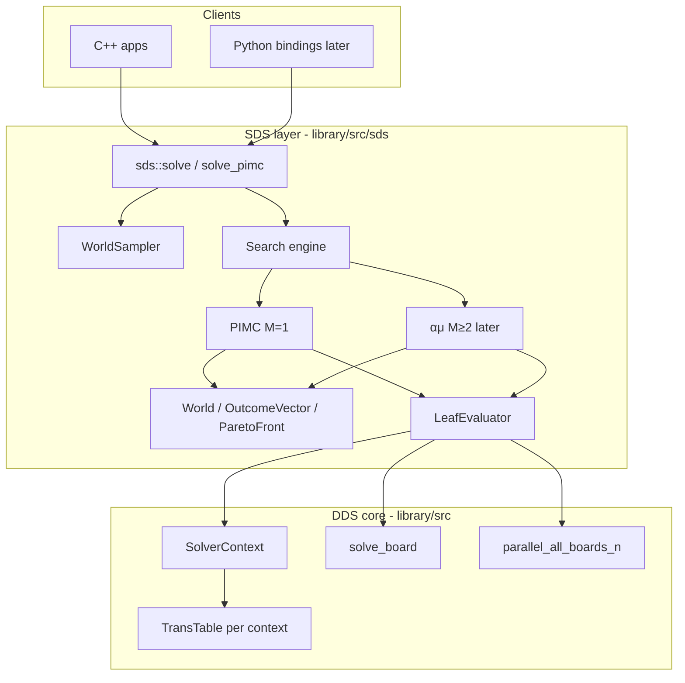
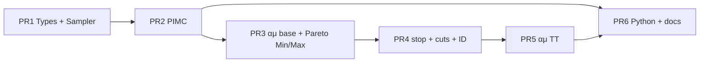
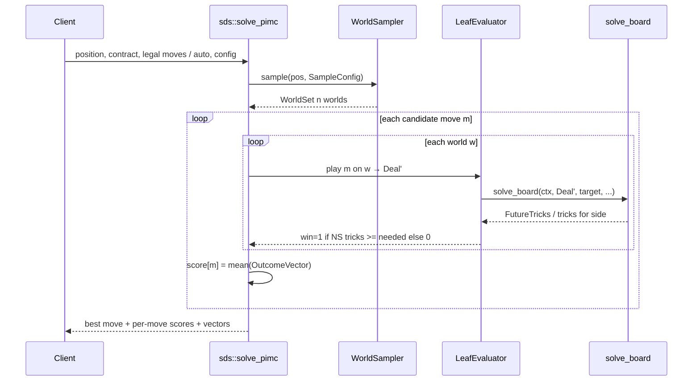
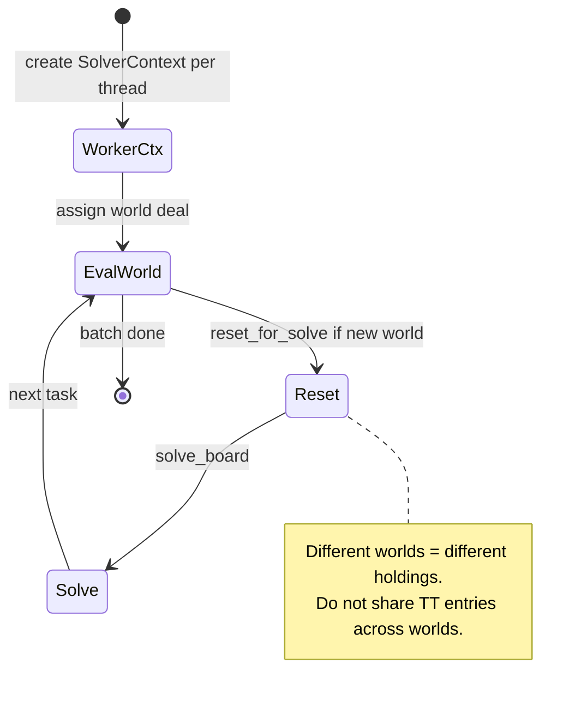

# SDS: Single Dummy Solver — Design Document

| Field | Value |
| --- | --- |
| **Title** | Integrating a Single Dummy Solver (SDS) into DDS3 via αμ / PIMC |
| **Author** | TBD |
| **Date** | 2026-07-17 |
| **Status** | Draft |
| **Branch** | `sds` |
| **Primary reference** | Cazenave & Ventos, *The αμ Search Algorithm for the Game of Bridge*, arXiv:1911.07960 |
| **First slice** | PIMC (paper Algorithm 1) ≡ αμ with \(M=1\) |

---

## Overview

DDS3 is a high-performance **double-dummy** bridge solver: given a fully specified deal, it returns perfect-information trick counts via αβ search with transposition tables. Real bridge play is **incomplete information** — declarer and dummy see two hands, opponents' cards are hidden. Practitioners address this with **Perfect Information Monte Carlo (PIMC)**: sample possible worlds consistent with known cards, evaluate each candidate card under double dummy in each world, and pick the card with the best average score.

This document designs **SDS (Single Dummy Solver)** as a **sibling layer on top of DDS**, not a fork. SDS reuses `SolverContext` and `solve_board` for leaf evaluation. The first production slice implements **PIMC only** (paper Algorithm 1), correctly framed as the depth-\(M=1\) special case of **αμ**. The architecture is deliberately shaped so Algorithms 2–6 (Pareto fronts, Min/Max nodes, early/root cuts, transposition table, iterative deepening, world generation refinements) layer on without public API churn.

Paper performance baseline (Table 2, 52 cards, 20 worlds): **~0.096 s/move for \(M=1\)** with Haglund DDS as `doubleDummy`. Deeper search without optimizations is expensive (\(M=3\) ~18.7 s); with TT + early + root cuts it drops to ~1.2 s. SDS must therefore budget DD calls carefully and batch them where possible.

---

## Background & Motivation

### Current state

- Double-dummy library under `library/src/`.
- Preferred C++ API: `SolverContext` + snake_case (`solve_board`, `calc_dd_table`, …).
- Public umbrella: `#include <dds/dds.hpp>` → `library/src/dds.hpp`.
- Leaf evaluation entry point:

```cpp
auto solve_board(
    SolverContext& ctx,
    const Deal& dl,
    int target,
    int solutions,
    int mode,
    FutureTricks* futp) -> int;
```

- Deal representation (`library/src/api/dll.h`):

```cpp
struct Deal {
  int trump;                          // 0–3 suits, 4 = NT (DDS_NOTRUMP)
  int first;                          // lead hand 0=N … 3=W
  int currentTrickSuit[3];
  int currentTrickRank[3];
  unsigned int remainCards[DDS_HANDS][DDS_SUITS];  // rank bitmasks
};
```

- Parallel multi-board solving exists via `parallel_all_boards_n` / `solve_all_boards_n` (`library/src/system/parallel_boards.hpp`, `library/src/solve_board.cpp`).
- Bindings: Python (`python/`), .NET (`dotnet/`), WASM (`wasm/`, `web/`).
- **No existing single-dummy / PIMC / αμ code.**

### Pain points SDS addresses

| Pain | Why it matters |
| --- | --- |
| Users must reimplement sampling + multi-world DD orchestration outside the library | Duplicated bugs, inconsistent card encoding, no shared tests |
| Training / evaluation of declarer policies needs a correct single-dummy baseline | PIMC is the industry baseline (GIB, Wbridge5 lineage) |
| Path to strategy-fusion-aware search (αμ \(M>1\)) needs shared types | Outcome vectors and Pareto fronts must exist before deeper search |

### Why PIMC first

1. **αμ at \(M=1\) is PIMC** (paper §4.2, §5) — the natural baseline and leaf/depth-1 case.
2. It **reuses DDS double-dummy evaluation heavily** — this repo already provides that.
3. It surfaces all infrastructure risks early: world sampling, multi-world TT lifecycle, batching DD calls, contract-threshold scoring.
4. Paper Algorithm 1 is small enough for an independently reviewable PR while locking the public SDS surface.

### αμ problem framing (for later slices)

PIMC suffers from two well-known defects the paper targets:

1. **Strategy fusion** — Max is allowed different cards in different worlds for the “same” information state. αμ forces Max to play the same move in all valid worlds.
2. **Non-locality** — locally optimal vector choice at one Max node can destroy global optimality. αμ uses **Pareto fronts of outcome vectors** and a Min product/join (Algorithm 4).

SDS PIMC intentionally retains strategy fusion at depth 1 (same as classic PIMC). Later PRs add the αμ machinery without renaming the API.

---

## Goals & Non-Goals

### Goals

1. Introduce **SDS** as a first-class library component depending on DDS leaf evaluation.
2. Ship **PIMC (Algorithm 1)** with a stable C++ API and unit/golden tests.
3. Define data structures (`World`, `OutcomeVector`, `ParetoFront`, search state) that **αμ Algorithms 2–6 can use without redesign**.
4. Reuse `SolverContext` / `solve_board`; document multi-world TT policy (reuse vs reset).
5. Support constrained **world sampling** from partial information (known N/S or declarer+dummy hands, voids from play, remaining opponent cards).
6. Provide a clear **PR plan** with independently mergeable slices.
7. Match coding standards of DDS3: snake_case free functions, PascalCase types, trailing `_` members, Bazel packages.

### Non-Goals (this design / first slice)

- Full αμ search with cuts/TT (Algorithms 2–6) in the first PR.
- Bidding / inference of constraints from auction beyond simple contract metadata.
- Real IMP/matchpoint scoring optimization (paper maximizes \(P(\text{make})\); score-aware objective is future work).
- Defense-as-αμ with incomplete information for both sides (paper future work).
- .NET / WASM bindings for SDS (Python is a later PR; others later still).
- Replacing or modifying the double-dummy αβ core.
- Partition-search normalization for equivalent cards (paper §4.11) in PIMC-only slice (optional micro-opt later).

---

## Key Decisions

| # | Decision | Rationale |
| --- | --- | --- |
| K1 | **Name the feature SDS** (Single Dummy Solver), sibling of DDS | Clear product boundary; “single dummy” is the common name for incomplete-info card play with known dummy. |
| K2 | **New package `library/src/sds/`**, separate Bazel target `//library/src/sds:sds` depending on `//library/src:dds` | Avoids bloating the DD core; allows independent tests/build; mirrors modular layout (`moves/`, `trans_table/`, …). |
| K3 | **First algorithm: PIMC only** (Algorithm 1), exposed as `sds::solve_pimc` and as `sds::solve` with `SdsConfig::max_depth = 1` | Delivers value immediately; αμ \(M=1\) ≡ PIMC; one search entry point for later depths. |
| K4 | **Public types include `OutcomeVector` and `ParetoFront` from day one**, even though PIMC only averages 0/1 scores | Prevents API churn when Algorithm 2 lands; PIMC becomes “αμ with \(M=1\)” in implementation, not only in docs. |
| K5 | **Leaf evaluation always goes through `solve_board(SolverContext&, …)`** | Respects DDS3 modernization; enables per-worker contexts and TT control. |
| K6 | **Multi-world DD: one `SolverContext` per worker thread; `reset_for_solve()` between unrelated worlds by default** | `SolverContext` is not thread-safe. Cross-world TT reuse is unsafe (different card holdings). Same-world incremental play can reuse TT later in αμ. |
| K7 | **Objective default: maximize \(P(\text{make})\) given `contract_tricks`** (e.g. 9 for 3NT) | Matches paper experiments; binary outcomes feed OutcomeVector cleanly. Optional raw-trick average as config switch. |
| K8 | **Worlds are full `Deal`s (or compact card assignments)** constrained by a `PartialDeal` / `SdsPosition` | Reuses existing `Deal` for `solve_board`; sampling owns constraint logic separately. |
| K9 | **PIMC move selection uses legal moves of the *known* side only** (declarer/dummy at the seat to play); scored per world after applying the same card | Matches Algorithm 1; prepares strategy-fusion semantics for Max. |
| K10 | **Batch DD calls via internal board list + optional `parallel_all_boards`-style workers** for PIMC’s move×world grid | Paper’s cost is dominated by DD; parallelism is the main lever for latency. |
| K11 | **Do not expose a C `dll.h` STDCALL surface for SDS in v1** | SDS is C++-first like modern DDS3 APIs; Python via pybind later. Avoids locking a C ABI early. |
| K12 | **Umbrella include remains `<dds/dds.hpp>` for DD only; SDS uses `<dds/sds.hpp>` or `sds/sds.hpp`** | Keeps DD clients free of SDS dependency; optional convenience umbrella later. |

---

## Proposed Design

### High-level architecture



### Layering relative to αμ algorithms

| Paper piece | SDS component | First appears |
| --- | --- | --- |
| Algorithm 1 PIMC | `PimcSearch` | PR2 |
| Outcome vectors | `OutcomeVector` | PR1 |
| Pareto fronts | `ParetoFront` | PR1 (ops used PR3) |
| Algorithm 2 αμ base | `AmuSearch` | PR3 |
| Algorithm 3 `stop()` | `should_stop` + contract/defense trick checks | PR2 stub / PR4 full |
| Algorithm 4 Min join | `ParetoFront::min_join` | PR3 |
| Algorithm 5 front ≤ | `ParetoFront::dominated_by` | PR3–PR4 |
| Early/root cuts | `AmuSearch` cut hooks | PR4 |
| Iterative deepening | `AmuSearch::solve_id` | PR4 |
| Algorithm 6 TT | `AmuTransTable` (SDS-level, not DDS TT) | PR5 |
| §4.12 world generation | `WorldSampler` | PR1 |



### Position and information model

SDS operates on a **partial information position**, not only a full `Deal`.

```cpp
namespace sds {

// Seat indices match DDS: 0=N, 1=E, 2=S, 3=W.
struct Card {
  std::uint8_t suit;  // 0..3
  std::uint8_t rank;  // 2..14 (Ace = 14), same as DDS rank encoding
};

struct SdsPosition {
  int trump_ = 4;                 // DDS_NOTRUMP default
  int first_ = 0;                 // leader of current trick
  int current_trick_suit_[3]{};
  int current_trick_rank_[3]{};

  // Known holdings (bitmasks, same as Deal::remainCards).
  // Unknown seats: 0; sampling fills them.
  unsigned int known_cards_[DDS_HANDS][DDS_SUITS]{};

  // Which seats are fully known (typically declarer + dummy).
  bool seat_known_[DDS_HANDS]{};

  // Cards already played that constrain remaining distribution
  // (optional structured history; v1 may use void flags only).
  std::array<bool, DDS_HANDS * DDS_SUITS> known_void_{}; // [hand*4+suit]

  int tricks_ns_ = 0;             // completed tricks for N/S (Max)
  int tricks_ew_ = 0;             // completed tricks for E/W (Min)
  int to_play_ = 0;               // absolute hand to move
};

struct Contract {
  int tricks_needed_ = 9;         // e.g. 9 for 3NT
  // Optional: strain already in SdsPosition::trump_
};

}  // namespace sds
```

**Mapping to paper terms:**

- `state` ≈ `SdsPosition` (public cards / play state without hidden cards).
- `Worlds` ≈ `std::vector<World>` where each `World` is a complete assignment of remaining cards to all seats, representable as a `Deal`.

### Core data structures (αμ-ready)

Even for PIMC-only, define types the paper needs:

```cpp
namespace sds {

// Bit-packed or dense 0/1 outcomes over n worlds.
// v1: std::vector<std::uint8_t> of size n; later may pack bits.
class OutcomeVector {
 public:
  explicit OutcomeVector(std::size_t n_worlds);

  auto size() const -> std::size_t;
  auto operator[](std::size_t i) -> std::uint8_t&;
  auto operator[](std::size_t i) const -> std::uint8_t;

  // Paper: average among possible worlds.
  auto mean(const std::vector<bool>* valid = nullptr) const -> double;

  // Element-wise max / min (paper vector max/min).
  static auto elementwise_max(const OutcomeVector& a, const OutcomeVector& b)
      -> OutcomeVector;
  static auto elementwise_min(const OutcomeVector& a, const OutcomeVector& b)
      -> OutcomeVector;

  // Dominance: a >= b componentwise on the valid mask.
  auto dominates(const OutcomeVector& other,
                 const std::vector<bool>* valid = nullptr) const -> bool;

 private:
  std::vector<std::uint8_t> bits_;
};

// Set of non-dominated OutcomeVectors.
class ParetoFront {
 public:
  auto empty() const -> bool;
  auto vectors() const -> const std::vector<OutcomeVector>&;

  // Insert if not dominated; remove newly dominated vectors.
  auto insert(OutcomeVector v) -> void;

  // Max node: union of fronts with dominance pruning.
  static auto max_union(const ParetoFront& a, const ParetoFront& b)
      -> ParetoFront;

  // Algorithm 4: product/min-join of two fronts.
  static auto min_join(const ParetoFront& a, const ParetoFront& b)
      -> ParetoFront;

  // Algorithm 5: front <= other iff every vector in *this is dominated by some
  // vector in other.
  auto is_leq(const ParetoFront& other) const -> bool;

  // Best mean among members (μ(front) in paper).
  auto best_mean(const std::vector<bool>* valid = nullptr) const -> double;

 private:
  std::vector<OutcomeVector> vecs_;
};

// One fully specified remaining-card assignment.
struct World {
  Deal deal_{};                  // ready for solve_board
  // Optional: valid-world flag updates during αμ search when Min plays
  // a card illegal in some worlds.
};

// Sampled set for one decision.
struct WorldSet {
  std::vector<World> worlds_;
  // Per-world validity mask (all true at root).
  std::vector<bool> valid_;
};

}  // namespace sds
```

**PIMC usage of these types:** for each candidate move, build an `OutcomeVector` of length \(n\) by DD evaluation after playing the move in each world; the move’s score is `vector.mean()`. The “Pareto front” of a PIMC leaf is a singleton `{vector}`. This makes the step from PIMC to Algorithm 2 mechanical.

### World sampling (§4.12)

```cpp
struct SampleConfig {
  int num_worlds_ = 20;           // paper uses 20–40
  std::uint64_t seed_ = 0;        // 0 = nondeterministic; tests pass explicit seeds
  int max_rejection_attempts_ = 100000;
  // Future: auction shape constraints, HCP ranges, etc.
};

class WorldSampler {
 public:
  // Generate worlds consistent with position + known voids + known cards.
  // Algorithm: reconstruct remaining multi-set of cards; deal randomly to
  // unknown seats with equal hand lengths; reject on void violations and
  // any registered constraint predicates.
  auto sample(const SdsPosition& pos, const SampleConfig& cfg) const
      -> WorldSet;
};
```

**Constraints (v1):**

1. **Known seats**: cards in `known_cards_[h][*]` fixed for `seat_known_[h]`.
2. **Card conservation**: every remaining rank appears exactly once across four hands.
3. **Hand lengths**: remaining card counts per seat match cards still to play (accounting for current trick).
4. **Known voids**: if `known_void_[h,s]`, sampled hand \(h\) has no cards in suit \(s\).
5. **Current trick cards**: already played cards excluded from remaining multi-set.

**v1 non-goals for sampler:** full PBN auction constraint language; Bayesian weights other than uniform among accepted samples. Extension points: `Constraint` interface with `accepts(const Deal&)`.



### PIMC algorithm (first slice)

Paper Algorithm 1, specialized for make-probability:

```
function solve_pimc(allMoves, Worlds, contract):
  for move in allMoves:
    score[move] ← 0
    for w in Worlds:
      s ← play(move, w)
      score[move] ← score[move] + doubleDummy_makes(s, contract)
  return argmax_move(score)
```

**DDS leaf evaluation policy:**

| Parameter | Recommended default | Notes |
| --- | --- | --- |
| `target` | tricks still needed for Max side after partial tricks, or `-1` then threshold in software | Prefer binary target when only make/fail is needed: `target = remaining_tricks_needed` with solutions that answer “can we take ≥ target?” |
| `solutions` | `1` | One optimal line is enough for 0/1 make check |
| `mode` | `1` or `0` | Prefer modes that preserve TT usefully within same deal; reset between worlds |

Concrete helper:

```cpp
// Returns 1 if the side-to-maximize (N/S by default) can take enough
// remaining tricks to reach contract_tricks given tricks already won.
auto double_dummy_makes(
    SolverContext& ctx,
    const Deal& after_move,
    const Contract& contract,
    int tricks_ns_so_far,
    int tricks_ew_so_far) -> int;
```

Implementation sketch:

1. Call `solve_board(ctx, after_move, /*target=*/-1, /*solutions=*/1, /*mode=*/1, &fut)`.
2. `fut.score[0]` is remaining tricks for the side to play’s partnership under DDS conventions — **must verify against DDS score semantics in unit tests** (who the score is for). Normalize to NS tricks remaining.
3. `makes = (tricks_ns_so_far + ns_remaining >= contract.tricks_needed_)`.

**Risk (medium):** DDS `FutureTricks::score` is defined relative to the side on lead / declarer conventions in the core solver. SDS must encapsulate this in `LeafEvaluator` with golden tests against known deals rather than scattering interpretation at call sites.

### Multi-world / multi-move evaluation grid

For \(C\) candidate cards and \(N\) worlds, PIMC needs up to \(C \times N\) DD solves (often less if moves are suit-equivalent — optional).

**Batching strategy:**

1. Build a list of `Deal` positions (move × world).
2. Evaluate with a pool of `SolverContext` workers (size = `SdsConfig::num_threads_`).
3. Reuse the spirit of `parallel_all_boards_n` but **do not** call legacy global `SolveBoard(..., threadIndex)` if it conflicts with instance-scoped contexts — prefer explicit worker contexts (aligns with DDS3 motivation: parallel solves + TT ownership).

```cpp
struct SdsConfig {
  int max_depth_ = 1;             // M; PIMC = 1
  int num_worlds_ = 20;
  int num_threads_ = 0;           // 0 = hardware_concurrency
  std::uint64_t seed_ = 0;
  int contract_tricks_ = 9;
  bool maximize_make_probability_ = true;
  // TT: always reset between distinct worlds in PIMC.
  bool reset_tt_between_worlds_ = true;
  SolverConfig dds_solver_config_{};  // TT size for each worker context
};
```

### TT lifecycle (critical)



| Scenario | Policy |
| --- | --- |
| PIMC: consecutive DD on **different worlds** | `ctx.reset_for_solve()` (or `clear_tt()` if memory pressure) before each world |
| αμ later: multiple DD leaves under **same world** after card plays | Prefer keep TT / mode that reuses same-deal search (matches README training use case) |
| Worker reuse across moves | Keep `SolverContext` alive for thread pool lifetime; reset per world |

**Do not** use the DDS search transposition table as the αμ TT. Paper Algorithm 6 TT maps **information-set / multi-world states → ParetoFront**. That is a separate `AmuTransTable` keyed by compact state hash + valid-world mask + \(M\).

### Search engine shape (forward-compatible API)

```cpp
namespace sds {

struct MoveScore {
  int suit_ = 0;
  int rank_ = 0;
  double score_ = 0.0;            // mean make probability or mean tricks
  OutcomeVector outcomes_;        // length = n worlds
};

struct SdsResult {
  int best_suit_ = 0;
  int best_rank_ = 0;
  std::vector<MoveScore> moves_;  // all evaluated moves
  int num_worlds_ = 0;
  int num_dd_calls_ = 0;
  double elapsed_seconds_ = 0.0;
  // Later: ParetoFront root_front_;
};

// Primary entry: dispatches on config.max_depth_.
// max_depth_ == 1 → PIMC path (Algorithm 1).
// max_depth_ >= 2 → αμ (available after PR3+).
auto solve(
    const SdsPosition& position,
    const Contract& contract,
    const SdsConfig& config,
    SolverContext* optional_shared_ctx = nullptr) -> SdsResult;

// Explicit Algorithm 1 entry (always PIMC regardless of max_depth_ field).
auto solve_pimc(
    const SdsPosition& position,
    const Contract& contract,
    const SdsConfig& config) -> SdsResult;

// Legal cards for the seat to play given known cards in that seat
// (and full world for validation in tests).
auto legal_moves(const SdsPosition& position) -> std::vector<Card>;

}  // namespace sds
```

**Why both `solve` and `solve_pimc`:** `solve_pimc` is the stable name for Algorithm 1 in tests and docs; `solve` is the long-term dispatcher so clients can raise \(M\) via config without code changes.

### Package layout

```text
library/src/sds/
  BUILD.bazel
  sds.hpp                 # public umbrella for SDS
  types.hpp / types.cpp   # OutcomeVector, ParetoFront, World, Card
  position.hpp            # SdsPosition, Contract
  world_sampler.hpp/.cpp
  leaf_evaluator.hpp/.cpp # double_dummy_makes via solve_board
  pimc.hpp / pimc.cpp     # Algorithm 1
  search.hpp / search.cpp # solve() dispatcher
  # Later:
  # amu.hpp / amu.cpp
  # amu_tt.hpp / amu_tt.cpp
  # stop.hpp

library/tests/sds/
  BUILD.bazel
  outcome_vector_test.cpp
  pareto_front_test.cpp
  world_sampler_test.cpp
  pimc_test.cpp
  golden_strategy_fusion_test.cpp   # paper §2 hands (document expected PIMC failure)
```

Bazel sketch:

```python
# library/src/sds/BUILD.bazel
cc_library(
    name = "sds",
    srcs = [...],
    hdrs = ["sds.hpp", ...],
    includes = ["."],
    deps = ["//library/src:dds"],
    visibility = ["//visibility:public"],
    # include_prefix / strip as needed for <dds/sds.hpp> or <sds/...>
)
```

### Legal moves

For PIMC Max at root:

- Generate legal cards from the **known hand** of `to_play_` using follow-suit rules against `current_trick_*`.
- Optionally reuse patterns from internal `Moves` class — but `Moves` is deep in DD search state. Prefer a **small pure function** in SDS that operates on bitmasks to avoid coupling to `ThreadData`.

```cpp
auto legal_moves(const SdsPosition& pos) -> std::vector<Card>;
```

### Mapping paper algorithms to code (roadmap sketch)

**Algorithm 2 (αμ without cuts)** — recursive on `(position, M, WorldSet)`:

- `stop()` → contract made / defense has too many tricks / \(M=0\) → evaluate each valid world with `LeafEvaluator`.
- Min node: union legal moves over worlds; for each move, restrict worlds where move is legal; recurse with same \(M\); `min_join` fronts.
- Max node: same but \(M-1\) and `max_union`.

**Algorithm 3 `stop()`** optimizations matter before deep \(M\); for PIMC, only the \(M=0\) branch (immediate after one Max move) is required, plus optional short-circuit if contract already decided.

**Algorithm 6** adds αμ TT + early cut + root cut; iterative deepening outer loop over \(M=1..M_{\max}\).

---

## API / Interface Changes

### New public C++ surface (additive only)

| Header | Contents |
| --- | --- |
| `library/src/sds/sds.hpp` | Includes types + `solve` / `solve_pimc` |
| `library/src/sds/types.hpp` | `OutcomeVector`, `ParetoFront`, `World`, … |
| `library/src/sds/position.hpp` | `SdsPosition`, `Contract`, `Card` |

No changes required to `dll.h` / legacy C API for v1.

Optional later: export from `dds.hpp` behind a comment — **not recommended** until SDS is stable.

### Example client (PIMC)

```cpp
#include <sds/sds.hpp>
#include <iostream>

int main() {
  sds::SdsPosition pos;
  pos.trump_ = 4;          // NT
  pos.first_ = 1;          // East leads example — set for real deals
  pos.to_play_ = 2;        // South to play
  pos.seat_known_[0] = true;
  pos.seat_known_[2] = true;
  // fill pos.known_cards_ for N and S ...

  sds::Contract contract{.tricks_needed_ = 9};
  sds::SdsConfig cfg;
  cfg.num_worlds_ = 20;
  cfg.seed_ = 42;
  cfg.max_depth_ = 1;
  cfg.num_threads_ = 4;

  const sds::SdsResult result = sds::solve_pimc(pos, contract, cfg);
  std::cout << "best " << result.best_suit_ << " " << result.best_rank_
            << " p_make=" << result.moves_.front().score_ << "\n";
}
```

### Python (PR6, sketch only)

```python
import dds3

result = dds3.solve_pimc(
    position={...},
    contract_tricks=9,
    num_worlds=20,
    seed=42,
)
print(result.best_suit, result.best_rank, result.moves)
```

### Before / after (user workflow)

| Before | After |
| --- | --- |
| User samples deals ad hoc, loops `solve_board`, averages tricks | `sds::solve_pimc(position, contract, config)` |
| No shared golden hands for strategy fusion | Tests encode paper examples |
| No path to αμ | Raise `max_depth_` when Algorithm 2+ ships |

---

## Data Model Changes

### Persistent storage

None. SDS is compute-only; no on-disk schema.

### In-memory model

| Type | Approx size | Notes |
| --- | --- | --- |
| `World` / `Deal` | ~100 B | 4×4 `unsigned` + trick fields |
| `WorldSet` 40 worlds | ~4–8 KB | Negligible vs DD TT |
| `OutcomeVector` n=40 | 40 B dense | Bit-pack later if fronts explode |
| `ParetoFront` | variable | Min product can grow; needs caps later |
| Worker `SolverContext` TT | 64–512 MB class (user config) | Dominates memory; **one per thread**, not per world |

### Migration

N/A — pure additive library package.

---

## Alternatives Considered

### Alternative A — Implement full αμ (Algorithm 6) in one PR

| Pros | Cons |
| --- | --- |
| One “complete” feature | Large review; hard to bisect correctness of sampling vs Min-join vs cuts |
| Matches paper end state | Delays usable PIMC baseline |

**Rejected** for first delivery. PR plan stages Algorithms 1→2→6.

### Alternative B — Keep PIMC only types (averages as `double[]`), add vectors later

| Pros | Cons |
| --- | --- |
| Slightly less code in PR1–2 | Public result type churn; harder to claim “αμ \(M=1\)” |
| | Risk of re-plumbing leaf scores |

**Rejected** in favor of K4: define `OutcomeVector` / `ParetoFront` early.

### Alternative C — Shell out to multi-process or external PIMC tools

| Pros | Cons |
| --- | --- |
| No library risk | Breaks DDS3-as-library story; poor TT control; worse Python UX |

**Rejected.**

### Alternative D — Reuse legacy `SolveAllBoards` global thread pool exclusively

| Pros | Cons |
| --- | --- |
| Existing parallel path | Global/thread-index model fights `SolverContext` ownership; README motivation for v3 was exactly parallel + TT reuse with instance state |

**Partial adoption:** reuse **work-stealing pattern** from `parallel_all_boards_n`, but drive **instance `SolverContext` workers** inside SDS.

### Alternative E — Put SDS sources inside `library/src/*.cpp` without a subpackage

| Pros | Cons |
| --- | --- |
| Fewer BUILD files | Violates modular structure; couples rebuilds; weaker visibility control |

**Rejected** in favor of `library/src/sds/`.

---

## Security & Privacy Considerations

| Topic | Assessment |
| --- | --- |
| Threat model | Local numeric library; no network surface in core SDS |
| Untrusted input | `SdsPosition` card masks must be validated (no double-dealt cards, ranks 2–14, suit 0–3) — return error codes / exceptions consistent with DDS bindings |
| RNG | Deterministic `seed` for tests; document that production seed = 0 uses `std::random_device` |
| Resource exhaustion | Cap `num_worlds_`, `num_threads_`, rejection attempts; DD TT memory bounded by `SolverConfig` |
| Privacy | Deal contents may be sensitive in online play contexts — SDS does not log deals by default; respect existing `Utilities` log flags if enabled |
| Side channels | N/A for v1 |

---

## Observability

### Logging

- Optional debug log (behind existing utilities / a `SdsConfig::verbose_`) of: world count accepted/rejected, per-move mean scores, DD call count, wall time.
- Do not spam per-node αμ logs by default (will be enormous at \(M≥2\)).

### Metrics (returned in `SdsResult` and optional counters)

| Metric | Purpose |
| --- | --- |
| `num_worlds_` | Sampling success |
| `num_dd_calls_` | Cost model / budget |
| `elapsed_seconds_` | Compare to paper Table 2 |
| rejection count (debug) | Sampler constraint tightness |
| later: TT hit rate, early/root cut counts | αμ optimization efficacy |

### Alerting

Not applicable inside the library. Host applications may alert on latency SLOs (e.g. p95 move time > budget).

### Performance targets (engineering goals, not guarantees)

| Configuration | Target ballpark |
| --- | --- |
| \(M=1\), 20 worlds, ~5–10 candidates, mid-hand | ≤ ~0.1–0.3 s/move on modern laptop with multi-thread (paper 0.096 s single-thread-class with their DDS build) |
| \(M=1\), 40 worlds | ~2× DD budget |
| \(M=3\) after PR4–5 | aspire to paper ~1–2 s/move with TT+cuts |

Instrument microbenchmarks under `//library/tests/sds` or `examples/`.

---

## Rollout Plan

### Feature flags

- No compile-time flag required if SDS is a separate target — clients opt in by depending on `//library/src/sds:sds`.
- Optional: `max_depth_ >= 2` returns `NOT_IMPLEMENTED` until PR3 merges (fail closed).

### Staged delivery

1. **PR1–2**: types + PIMC; internal dogfood via unit tests and one example binary.
2. **PR3–5**: αμ progression; keep `solve_pimc` golden outputs stable (regression gate).
3. **PR6**: Python + docs; announce SDS in README.

### Rollback

- Purely additive: revert the SDS package commits; DDS core unchanged.
- If a PR regresses DD through accidental coupling, that PR fails review — SDS must not modify αβ internals.

### Compatibility

- Semantic versioning: SDS experimental until Python ships; then minor version bump of the repo module (`MODULE.bazel` version).

---

## Testing Strategy

### Unit tests (PR1)

| Area | Cases |
| --- | --- |
| `OutcomeVector` | mean, dominance, elementwise min/max |
| `ParetoFront` | insert dominance, max_union, min_join examples from paper Fig. 2 |
| `WorldSampler` | fixed seed reproducibility; known N/S hands preserved; void constraints; no duplicate cards; correct hand lengths |
| `legal_moves` | follow suit; trump; leading |

### Integration tests (PR2)

| Area | Cases |
| --- | --- |
| `LeafEvaluator` | known full deals: `double_dummy_makes` matches manual `solve_board` thresholding |
| `solve_pimc` | single-world degeneration: best move matches pure DD best make move |
| Multi-world | synthetic 2-world fixture where move A wins only world 0, B wins both → B selected |
| Parallel vs seq | same seed → same scores (allowing float equality on means of 0/1) |

### Golden / paper hands

Encode simplified end positions from paper §2:

1. **Strategy fusion (spade finesse)** — document that **PIMC misevaluates** (always “makes”) while later αμ \(M≥2\) should prefer discovery-consistent lines when depth allows. Test asserts PIMC behavior explicitly so upgrades can flip expectations deliberately.
2. **Non-locality spade ending** — PIMC vs future αμ comparison tests (αμ side gated until PR3+).

### Property / stress

- Sampler acceptance rate under tight voids.
- Budget test: \(N=20\), fixed deal, assert `num_dd_calls_ <= C*N`.

### CI

```bash
bazel test //library/tests/sds/...
bazel test //...   # full tree green
```

---

## Risks

| Risk | Severity | Mitigation |
| --- | --- | --- |
| Misinterpretation of `FutureTricks::score` side | **High** | Centralize in `LeafEvaluator`; golden full-deal tests |
| Cross-world TT pollution | **High** | Default `reset_for_solve()` per world; code review checklist |
| Sampler bias / impossibility under constraints | **Medium** | Return clear error if not enough worlds; log rejection rate |
| Pareto front blow-up at Min nodes (later) | **Medium** | Cap front size; tests on paper figures; profile in PR3 |
| Parallel nondeterminism | **Low** | Pure aggregation of 0/1; deterministic move sort for ties |
| Latency far above paper | **Medium** | Batch + threads; solutions=1; avoid solutions=3 in leaves |
| Scope creep into full αμ in PR2 | **Medium** | PR plan gates; `max_depth_>=2` unimplemented |

---

## Open Questions

1. **Declarer seat / Max side:** Paper Max = declarer side. Should v1 hardcode Max = N/S, or take `max_partnership` (NS vs EW) and `declarer_seat` explicitly for defense-play use?
2. **Default contract objective:** Confirm maximize \(P(\text{make})\) only, vs optional expected tricks / crude IMPs in `SdsConfig`.
3. **Include path:** Prefer `#include <dds/sds.hpp>` (under dds prefix) or `#include <sds/sds.hpp>`?
4. **Error handling style:** Integer codes like DDS `RETURN_*`, or C++ `std::expected` / exceptions for SDS-only errors (bad position, sampling failure)?
5. **Equivalent-card pruning (paper §4.11):** Worth doing in PIMC PR2 to cut DD calls, or defer?
6. **Thread pool ownership:** Process-wide pool vs per-`solve_pimc` pool? (Affects latency vs fairness in multi-tenant hosts.)
7. **Partial play history:** Is void-bit tracking enough for v1, or do we need full trick history for inference constraints (Gitelman-style example in paper)?
8. **Multi-threading vs WASM:** Should SDS force `num_threads_=1` on WASM builds initially?
9. **Tie-breaking:** When two moves share mean make probability, break by expected overtricks, absolute rank, or stable suit/rank order?
10. **Repo messaging:** Advertise SDS in root `README.md` at PR2 or wait for PR6?

---

## References

1. Tristan Cazenave & Véronique Ventos, *The αμ Search Algorithm for the Game of Bridge*, arXiv:1911.07960, https://arxiv.org/pdf/1911.07960  
2. Bo Haglund / Søren Hein / DDS3 — this repository (`README.md`, `docs/c++_interface.md`)  
3. `library/src/api/solve_board.hpp` — preferred leaf API  
4. `library/src/solver_context/solver_context.hpp` — TT lifecycle  
5. `library/src/system/parallel_boards.hpp` — parallel evaluation pattern  
6. `library/src/api/dll.h` — `Deal`, `FutureTricks`  
7. Frank & Basin, *Search in games with incomplete information* (strategy fusion / non-locality)  
8. Ginsberg, GIB — PIMC in competitive bridge programs  

---

## PR Plan

Each PR is independently reviewable and mergeable. Later PRs may depend on earlier ones as noted.

### PR1 — Core SDS types + world sampling (no search)

| | |
| --- | --- |
| **Title** | `sds: add OutcomeVector, ParetoFront, SdsPosition, and WorldSampler` |
| **Files / components** | `library/src/sds/{BUILD.bazel,sds.hpp,types.hpp,types.cpp,position.hpp,world_sampler.hpp,world_sampler.cpp,legal_moves.hpp,legal_moves.cpp}`; `library/tests/sds/{BUILD.bazel,outcome_vector_test.cpp,pareto_front_test.cpp,world_sampler_test.cpp,legal_moves_test.cpp}` |
| **Depends on** | None (DDS already present) |
| **Description** | Introduce the `//library/src/sds:sds` package with αμ-ready types and constrained world sampling. No calls to `solve_board`. Unit tests for dominance, min_join on paper-scale vectors, sampler invariants, legal move generation from known hands. |

### PR2 — PIMC (Algorithm 1) + C++ API + DD leaf tests

| | |
| --- | --- |
| **Title** | `sds: implement PIMC (αμ M=1) via solve_board leaves` |
| **Files / components** | `library/src/sds/{leaf_evaluator.*,pimc.*,search.*}`; update `sds.hpp`; tests `pimc_test.cpp`, `leaf_evaluator_test.cpp`, `golden_strategy_fusion_test.cpp`; optional `examples/sds_pimc_example.cpp` + `examples/BUILD.bazel` |
| **Depends on** | PR1 |
| **Description** | Implement `LeafEvaluator::double_dummy_makes`, multi-world worker pool with per-thread `SolverContext` and TT reset policy, `solve_pimc` / `solve` (`max_depth_==1`). Tests: single-world equivalence, multi-world synthetic selection, score-side interpretation goldens, documented PIMC behavior on strategy-fusion example. |

### PR3 — αμ base without cuts (Algorithm 2) + Pareto Min/Max wiring

| | |
| --- | --- |
| **Title** | `sds: αμ search for M≥2 without cuts or TT` |
| **Files / components** | `library/src/sds/{amu.hpp,amu.cpp,stop.hpp}`; extend `search.cpp` dispatcher; tests for Max union, Min join on non-locality figure, shallow endgame \(M=2\) |
| **Depends on** | PR2 |
| **Description** | Recursive αμ with strategy fusion (same Max move all worlds), Min product of fronts, `stop()` at \(M=0\) and contract decided. No early/root cuts, no αμ TT, no iterative deepening yet. Keep `solve_pimc` path as fast special case (or as `amu` with \(M=1\)). |

### PR4 — `stop()` optimizations + early/root cuts + iterative deepening

| | |
| --- | --- |
| **Title** | `sds: early cut, root cut, and iterative deepening for αμ` |
| **Files / components** | Extend `amu.*`, `ParetoFront::is_leq`; config fields for `max_depth_` iterative schedule; benchmarks/tests for cut correctness |
| **Depends on** | PR3 |
| **Description** | Implement Algorithm 5 comparisons for early cut at Min nodes; root cut when μ matches previous ID iteration; outer iterative deepening \(M=1..M_{\max}\). Validate no move-quality regression vs uncapped Algorithm 2 on small fixtures; measure speedup. |

### PR5 — αμ transposition table

| | |
| --- | --- |
| **Title** | `sds: transposition table for αμ states (Algorithm 6)` |
| **Files / components** | `library/src/sds/{amu_tt.hpp,amu_tt.cpp}`; integrate with ID move ordering (TT best move first) |
| **Depends on** | PR4 |
| **Description** | SDS-level TT mapping compact state key + valid-world mask + remaining \(M\) → `{ParetoFront, best_move}`. Separate from DDS `TransTable`. Tests: hit returns same front; replacement policy; memory cap. Target approach paper Table 2 speedups with TT+cuts. |

### PR6 — Python bindings, examples, and documentation

| | |
| --- | --- |
| **Title** | `sds: Python bindings, docs, and README entry for SDS` |
| **Files / components** | `python/src/bindings.cpp` (or `sds_bindings.cpp`), `python/tests/test_sds_pimc.py`, `docs/sds.md` (user guide), root `README.md` link, `sds.md` design doc already in repo root as living design |
| **Depends on** | PR2 minimum for PIMC API; ideally PR5 for full `max_depth` exposure (can gate deeper \(M\) in Python) |
| **Description** | Expose `solve_pimc` / `solve` and result structures via pybind11 following existing `dds3` patterns (`gil_scoped_release` around compute). Document configuration, TT policy, and limits. Add at least one Python example. |

### Optional follow-ups (out of initial plan)

- Equivalent-card / partition normalization before search (§4.11).  
- Weighted worlds / auction constraints.  
- Defense-as-Max incomplete information.  
- .NET / WASM SDS surfaces.  
- Score-based (IMP) objectives instead of binary make.

---

*End of design document.*
